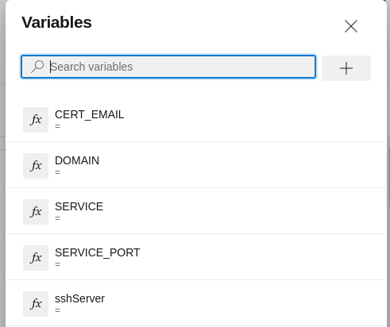

# Proxy-Certificate-Services
Project for proxy and certificate services

1. Put your service to run using docker and using the external network nginx-service. (example on [Monitoring-Host/docker-compose.yml](https://raw.githubusercontent.com/Lecarvalho/Proxy-Certificate-Services/main/docker-compose.yml))
2. Create an azure-devops pipeline using the azure-pipelines.yml from this repo.
3. Create following variables on the azure-devops pipeline:  

4. Create a SSH connection to the server under Project Settings > Service Connections
5. Run the pipeline and fill the variables.
Example values for the variables: 
```
CERT_EMAIL = youremail@email.com  
DOMAIN = yourdomain.com  
SERVICE = your_container_service_name //example: webservice  
SERVICE_PORT = the_port_your_service_is_exposed //exemple: 5000  
sshServer = the_service_connection_name_for_your_server  
```
